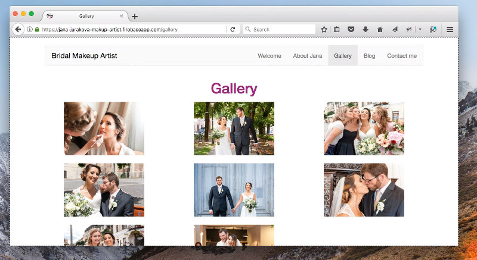

# Personal Project - Makeup Artist Website

A small progressive web application project, to improve my knowledge of modern web application development.

Build using Angular 5 on [Angular CLI version 1.5.0](https://github.com/angular/angular-cli).

## Development server

Run `ng serve` for a development server. Navigate to `http://localhost:4200/`. The app will automatically reload if you change any of the source files.

Or use `ng serve --host=192.168.X.X --port=4200` to specify your own port and host. The app will automatically reload if you change any of the source files.

## Build

Run `ng build` to build the project. The build artifacts will be stored in the `dist/` directory. 

Use `ng build -prod` flag for a production build.

Run `npm run precache` to generate a pre cache service worker that will be generated in the `dist/` directory. 

## Running unit tests

Run `ng test` to execute the unit tests via [Karma](https://karma-runner.github.io).

## Running end-to-end tests

Run `ng e2e` to execute the end-to-end tests via [Protractor](http://www.protractortest.org/).
